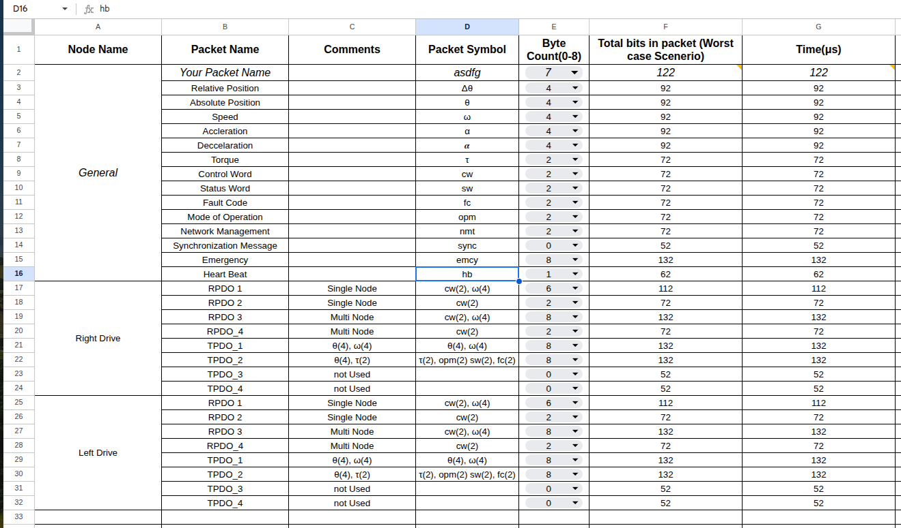

README

In the Bit parameter tab, only change the yellow boxes.

Byte Count (0–8) should be between 0–8 for CAN 2.0 A/B.

In the Timing Calculation sheet, the first two deduction rows are commented. Do not overwrite these with custom calculations—copy their formulas and calculate from the next row onward.

Please wait for CAN FD or CAN XL support; I am still working on it in my spare time. Alternatively, feel free to upgrade this and push the new sheet into this repo! Subhanallah—all collaboration is welcome!

